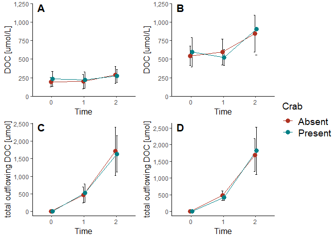
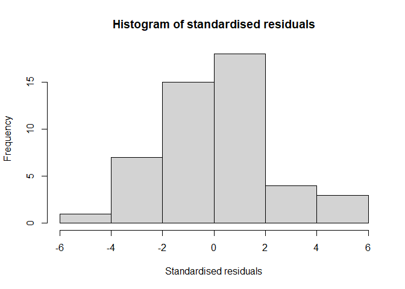
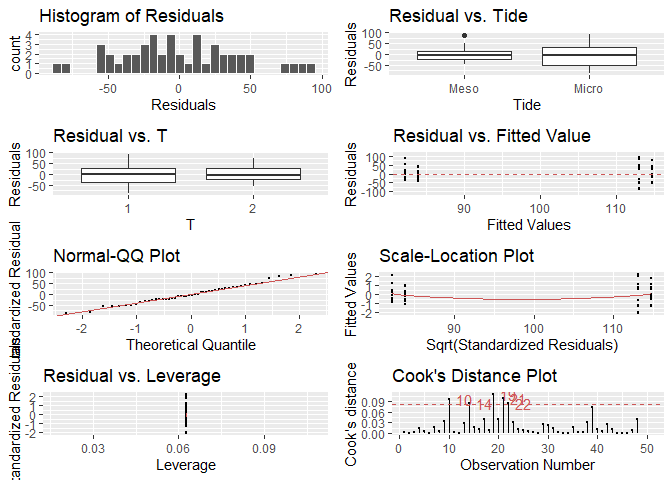

Interactive Effect of Crab Burrows and Tides on Mangrove Carbon Storage
================
Moritz Klaassen
May 27th 2021

This document displays the R-Script and Output of the thesis project "Interactive Effect of Crab Burrows and Tides on Mangrove Carbon Storage" conducted at the Leibniz Centre for Marine Tropical Research in Bremen, Germany within the frame of the International Master's in Marine Biological Resources (IMBRSea)

### Content

00\_Load Packages

01\_Attach, Subset and Prepare Data

    DOC Over Time
    DOC Changes
    Fractions
    POM
    CO2 Flux
    Leaching

02\_DOC Over Time

    Visualization 
        Mesotidal Concentration 
        Microtidal Concentration 
        Mesotidal Absolute 
        Microtidal Absolute
        

03\_DOC Changes

    Visualitation 
        Concentrations 
        Absolute 
    Statistics 
        Concentrations
            ANCOVA 
                Assumptions 
                    Linearity 
                    Homogeneity of Regression Slopes 
                    Normality of Residuals 
                    Homogeneity of Variances 
                    Visual Inspections 
                    Outliers
        Absolute
            ANCOVA 
                Assumptions 
                    Linearity 
                    Homogeneity of Regression Slopes 
                    Normality of Residuals 
                    Homogeneity of Variances 
                    Visual Inspections 
                    Outliers
                    

04\_Fractions

    Visualization 
        Dry Mass 
        Percentage 
    Statistics
        NMDS Analysis 
        PERMANOVA Assumptions 
        PERMANOVA (ADONIS)
        Pairwise Adonis 
        SIMPER
        

05\_POM

     Visualization
         Absolute Consumption 
         Percentage Consumption 
         Carapace Correlation GLOBAL 
         Carapace Correlation Meso vs. Micro
     Statistics 
         ANCOVA POM Consumption
                Assumptions 
                    Linearity 
                    Homogeneity of Regression Slopes 
                    Normality of Residuals 
                    Homogeneity of Variances 
                    Visual Inspections 
                    Outliers
                    

06\_CO2 Flux

     Visualization 
     Statistics
         ANCOVA CO2 Consumption
                Assumptions 
                    Linearity 
                    Homogeneity of Regression Slopes 
                    Normality of Residuals 
                    Homogeneity of Variances 
                    Visual Inspections 
                    Outliers
         ANCOVA log CO2 Consumption
                Assumptions 
                    Linearity 
                    Homogeneity of Regression Slopes 
                    Normality of Residuals 
                    Homogeneity of Variances 
                    Visual Inspections 
                    Outliers
         ANCOVA sqrt CO2 Consumption
                Assumptions 
                    Linearity 
                    Homogeneity of Regression Slopes 
                    Normality of Residuals 
                    Homogeneity of Variances 
                    Visual Inspections 
                    Outliers

07\_Leaching

     Visualization 
         DOC Leached 
         Leaching Rate
     Statistics 
         Anova Leaching Rate 
         Anova Assumptions 
             Normality of residuals 
             Homogeneity of Variances 
             Visual Inspections 

### 00\_Load Packages

``` r
library(ggplot2)
library(car)
library(RColorBrewer)
library(dplyr)
library(plyr)
library(magrittr)
library(knitr)
library(plyr)
library(knitr)
library(cowplot)
library(ggpubr)
library(metaviz)
library(irr)
library(vcd)
library(graphics)
library(reshape2)
library(lme4)
library(multcomp)
library(emmeans)
library(agricolae)
library(psych)
library(MuMIn)
library(MASS)
library(devtools)
library(pairwiseAdonis)
library(rstatix)
library(formatR)
library(rmarkdown)
library(tinytex)
library(htmltools)
library(xfun)
library(lindia)
library(MASS)
```

### 01\_Attach, Subset and Prepare Data

DOC Over Time

``` r
setwd("C:/Users/Moritz Klaassen/Desktop/Thesis")
data <- read.csv("DOCtime.csv",header = TRUE, dec = ",", sep = ";", na.string = "")
attach(data)
str(data)
data$Crab <- as.factor(data$Crab)
data$Tide <- as.factor(data$Tide)
data$T <- as.factor(data$T)
 
Meso <- droplevels((data[c(which(data$Tide=="Meso")),]))
CrabPMeso <- droplevels((Meso[c(which(Meso$Crab=="P")),]))
Micro <- droplevels((data[c(which(data$Tide=="Micro")),]))
CrabPMicro <- droplevels((Micro[c(which(Micro$Crab=="P")),]))
CrabAMeso <- droplevels((Meso[c(which(Meso$Crab=="A")),]))
CrabAMicro <- droplevels((Micro[c(which(Micro$Crab=="A")),]))

MesoP <- ddply(CrabPMeso, c("T", "Crab"), 
                                        summarise, 
                                        N    = length(Tide),
                                        mean = mean(DOC),
                                        sd   = sd(DOC),
                                        se   = sd / sqrt(N))
MesoA <- ddply(CrabAMeso, c("T", "Crab"), 
               summarise, 
               N    = length(Tide),
               mean = mean(DOC),
               sd   = sd(DOC),
               se   = sd / sqrt(N))

MesoAP <- ddply(Meso, c("T", "Crab"), 
               summarise, 
               N    = length(Tide),
               mean = mean(DOC),
               sd   = sd(DOC),
               se   = sd / sqrt(N))

MicroP <- ddply(CrabPMicro, c("T", "Crab"), 
               summarise, 
               N    = length(Tide),
               mean = mean(DOC),
               sd   = sd(DOC),
               se   = sd / sqrt(N))
MicroA <- ddply(CrabAMicro, c("T", "Crab"), 
               summarise, 
               N    = length(Tide),
               mean = mean(DOC),
               sd   = sd(DOC),
               se   = sd / sqrt(N))

MicroAP <- ddply(Micro, c("T", "Crab"), 
                summarise, 
                N    = length(Tide),
                mean = mean(DOC),
                sd   = sd(DOC),
                se   = sd / sqrt(N))

MesototP <- ddply(CrabPMeso, c("T", "Crab"), 
               summarise, 
               N    = length(Tide),
               mean = mean(DOC.per.Day),
               sd   = sd(DOC.per.Day),
               se   = sd / sqrt(N))
MesototA <- ddply(CrabAMeso, c("T", "Crab"), 
               summarise, 
               N    = length(Tide),
               mean = mean(DOC.per.Day),
               sd   = sd(DOC.per.Day),
               se   = sd / sqrt(N))

MesototAP <- ddply(Meso, c("T", "Crab"), 
                summarise, 
                N    = length(Tide),
                mean = mean(DOC.per.Day),
                sd   = sd(DOC.per.Day),
                se   = sd / sqrt(N))

MicrototP <- ddply(CrabPMicro, c("T", "Crab"), 
                summarise, 
                N    = length(Tide),
                mean = mean(DOC.per.Day),
                sd   = sd(DOC.per.Day),
                se   = sd / sqrt(N))
MicrototA <- ddply(CrabAMicro, c("T", "Crab"), 
                summarise, 
                N    = length(Tide),
                mean = mean(DOC.per.Day),
                sd   = sd(DOC.per.Day),
                se   = sd / sqrt(N))

MicrototAP <- ddply(Micro, c("T", "Crab"), 
                 summarise, 
                 N    = length(Tide),
                 mean = mean(DOC.per.Day),
                 sd   = sd(DOC.per.Day),
                 se   = sd / sqrt(N))
```

DOC Changes

``` r
setwd("C:/Users/Moritz Klaassen/Desktop/Thesis")
DOC <- read.csv("DOC.csv",header = TRUE, dec = ",", sep = ";", na.string = "")
attach(DOC)
str(DOC)
DOC$Crab <- as.factor(DOC$Crab)
DOC$Tide <- as.factor(DOC$Tide)

DOCMESOTIDAL <- droplevels((DOC[c(which(DOC$Tide=="Meso")),]))
DOCMICROTIDAL <- droplevels((DOC[c(which(DOC$Tide=="Micro")),]))
```

Fractions

``` r
setwd("C:/Users/Moritz Klaassen/Desktop/Thesis")
FractAbs <- read.csv("FractionAbs.csv",header = TRUE, dec = ",", sep = ";", na.string = "")
attach(FractAbs)
str(FractAbs)
FractAbs$Fraction <- as.factor(FractAbs$Fraction)

Abs <-  ddply(FractAbs, c("Fraction", "Tide"), 
              summarise, 
              N    = length(Tide),
              mean = mean(Weight),
              sd   = sd(Weight),
              se   = sd / sqrt(N))

Abs$Fraction <- factor(Abs$Fraction,levels = c(">0.5", ">1", ">2", ">4", ">8", ">16", ">32"))

FractPerc <- read.csv("FractionPerc.csv",header = TRUE, dec = ",", sep = ";", na.string = "")
attach(FractPerc)
str(FractPerc)
FractPerc$Fraction <- as.factor(FractPerc$Fraction)
FractPercMeso <- droplevels((FractPerc[c(which(FractPerc$Tide=="Mesotidal")),]))
FractPercMicro <- droplevels((FractPerc[c(which(FractPerc$Tide=="Microtidal")),]))

Perc <- ddply(FractPerc, c("Fraction", "Tide"), 
              summarise, 
              N    = length(Tide),
              mean = mean(Weight),
              sd   = sd(Weight),
              se   = sd / sqrt(N))

Perc$Fraction <- factor(Perc$Fraction,levels = c(">0.5", ">1", ">2", ">4", ">8", ">16", ">32"))

PERMFRAC1 <- read.csv("PERMFRAC1.csv",header = TRUE, dec = ",", sep = ";", na.string = "")
attach(PERMFRAC1)
str(PERMFRAC1)
PERMFRAC2 <- read.csv("PERMFRAC2.csv",header = TRUE, dec = ",", sep = ";", na.string = "")
attach(PERMFRAC2)
str(PERMFRAC2)
```

POM

``` r
setwd("C:/Users/Moritz Klaassen/Desktop/Thesis")

POM <- read.csv("POM2.csv",header = TRUE, dec = ",", sep = ";", na.string = "")
attach(POM)
str(POM)
POM$Tide <- as.factor(POM$Tide)
POM$Crab <- as.factor(POM$Crab)

POMP <- droplevels((POM[c(which(POM$Crab=="P")),]))
POMMESO <- droplevels((POMP[c(which(POMP$Tide=="Meso")),]))
POMMICRO <- droplevels((POMP[c(which(POMP$Tide=="Micro")),]))
```

CO2 Flux

``` r
setwd("C:/Users/Moritz Klaassen/Desktop/Thesis")
FLUX <- read.csv("CO2 FLUX.csv",header = TRUE, dec = ",", sep = ";", na.string = "")
attach(FLUX)
str(FLUX)
FLUX$Tide <- as.factor(FLUX$Tide)
FLUX$Crab <- as.factor(FLUX$Crab)

MESOFLUX <- droplevels((FLUX[c(which(FLUX$Tide=="Meso")),]))
MICROFLUX <- droplevels((FLUX[c(which(FLUX$Tide=="Micro")),]))
FLUX <- mutate(FLUX, sqrtFLUX = sqrt(mmol.Flux))
```

Leaching

``` r
setwd("C:/Users/Moritz Klaassen/Desktop/Thesis")

Leaching <- read.csv("Leaching.csv",header = TRUE, dec = ",", sep = ";", na.string = "")
attach(Leaching)
str(Leaching)
Leaching$Crab <- as.factor(Leaching$Crab)
Leaching$Tide <- as.factor(Leaching$Tide)
Leaching$T <- as.factor(Leaching$T)
Leaching <- droplevels((Leaching[c(which(Leaching$Crab=="A")),]))
```

### 02\_DOC Over Time

Visualization

``` r
setwd("C:/Users/Moritz Klaassen/Desktop/Thesis")
pd <- position_dodge(0.1) # move points .05 to the left and right from SE

a<-ggplot(MesoAP, aes(x=T, y=mean, group=Crab, colour=Crab)) + 
  geom_errorbar(aes(ymin=mean-sd, ymax=mean+sd), colour="black", width=.1, position=pd) +
  geom_line(position=pd) +
  geom_point(position=pd, size=3, shape=19) +
  xlab("T") +
  ylab("DOC [umol/L]") +
  scale_colour_hue(name="Crab",    
                   breaks=c("A", "P"),
                   labels=c("Absent", "Present"),
                   l=40) +  
  theme_classic()+
  theme(legend.position ="bottom")+
  expand_limits(y=0) +            
  scale_y_continuous(labels = scales::comma,limits=c(0, 1250), expand = c(0, 0))+
  xlab("Time")+
  theme(legend.title = element_text(color = "black", size = 14),
        legend.text = element_text(color = "black", size = 14),
        axis.title.x = element_text(size =12),
        axis.title.y = element_text(size =12))

b<-ggplot(MicroAP, aes(x=T, y=mean, group=Crab, colour=Crab)) + 
  geom_errorbar(aes(ymin=mean-sd, ymax=mean+sd), colour="black", width=.1, position=pd) +
  geom_line(position=pd) +
  scale_colour_hue(name="Crab",    
                   breaks=c("A", "P"),
                   labels=c("Absent", "Present"),
                   l=40) +    geom_point(position=pd, size=3, shape=19) +
  xlab("T") +
  ylab("DOC [umol/L]") +
  theme_classic()+
  theme(legend.position ="bottom")+
  expand_limits(y=0) +            
  scale_y_continuous(labels = scales::comma,limits=c(0, 1250), expand = c(0, 0))+
  xlab("Time") +
  theme(legend.title = element_text(color = "black", size = 14),
        legend.text = element_text(color = "black", size = 14),
        axis.title.x = element_text(size =12),
        axis.title.y = element_text(size =12))

c <- ggplot(MesototAP, aes(x=T, y=mean, group=Crab, colour=Crab)) + 
  geom_errorbar(aes(ymin=mean-sd, ymax=mean+sd), colour="black", width=.1, position=pd) +
  geom_line(position=pd) +
  geom_point(position=pd, size=3, shape=19) +
  xlab("T") +
  ylab("DOC [umol/L]") +
  scale_colour_hue(name="Crab",    
                   breaks=c("A", "P"),
                   labels=c("Absent", "Present"),
                   l=40) +  
  theme_classic()+
  theme(legend.position ="bottom")+
  expand_limits(y=0) +            
  scale_y_continuous(name="total outflowing DOC [umol]", labels = scales::comma, breaks=c(0, 500, 1000, 1500, 2000, 2500))+
  xlab("Time")+
  theme(legend.title = element_text(color = "black", size = 14),
        legend.text = element_text(color = "black", size = 14),
        axis.title.x = element_text(size =12),
        axis.title.y = element_text(size =12))

d<-ggplot(MicrototAP, aes(x=T, y=mean, group=Crab, colour=Crab)) + 
  geom_errorbar(aes(ymin=mean-sd, ymax=mean+sd), colour="black", width=.1, position=pd) +
  geom_line(position=pd) +
  geom_point(position=pd, size=3, shape=19) +
  xlab("T") +
  ylab("DOC [umol/L]") +  
  theme_classic()+
  theme(legend.position ="bottom")+
  expand_limits(y=0) +            
  scale_y_continuous(name="total outflowing DOC [umol]", labels = scales::comma, breaks=c(0, 500, 1000, 1500, 2000, 2500))+
  xlab("Time")+
  theme(legend.title = element_text(color = "black", size = 14),
        legend.text = element_text(color = "black", size = 14),
        axis.title.x = element_text(size =12),
        axis.title.y = element_text(size =12))+ 
  scale_colour_hue(name="Crab",    
                   breaks=c("A", "P"),
                   labels=c("Absent", "Present"),
                   l=40)

z <- ggarrange(a, b, c, d, ncol = 2, nrow = 2, common.legend = TRUE, legend ="right",  labels = "AUTO",   font.label = list(size = 16), hjust = c(-5, -5))
```

``` r
plot(z)
```



## 03\_DOC Changes

Visualization

``` r
# DOC Concentration
a <- ggplot(DOC, aes(x = Tide, y = DOCCONCTOT, fill = Crab)) +
  scale_y_continuous(name="DOC Concentration Change(umol/L)", labels = scales::comma, breaks=c(0, 250, 500, 750, 1000))+
  geom_boxplot(outlier.shape = NA) +
  theme_classic()+
  theme(axis.line.x = element_line(color = "black"), axis.line.y = element_line(color = "black"))+  scale_fill_brewer(breaks=c("A", "P"), 
                                                                                                                      labels=c('Absent', 'Present'),palette="Set2")+
  theme(axis.title.x = element_text(size =13))+
  theme(axis.title.y = element_text(size =11))+
  theme(legend.title = element_text(color = "black", size = 14),
        legend.text = element_text(color = "black", size = 14))+
  theme(legend.position ="bottom")

# DOC Absolute
b <-ggplot(DOC, aes(x = Tide, y = DOCABSTOT, fill = Crab)) +
  scale_y_continuous(name="Absolute DOC Change (umol)", labels = scales::comma, breaks=c(0, 500, 1000, 1500, 2000, 2500, 3000, 3500, 4000, 4500, 5000))+
  geom_boxplot(outlier.shape = NA) +
  theme_classic()+
  theme(axis.line.x = element_line(color = "black"), axis.line.y = element_line(color = "black"))+  scale_fill_brewer(breaks=c("A", "P"), 
                                                                                                                      labels=c('Absent', 'Present'),palette="Set2")+
  theme(axis.title.x = element_text(size =13))+
  theme(axis.title.y = element_text(size =11))+
  theme(legend.title = element_text(color = "black", size = 14),
        legend.text = element_text(color = "black", size = 14))+
  theme(legend.position ="bottom")

z <- ggarrange(a + rremove("xlab"), b , ncol = 1, nrow = 2, common.legend = TRUE, legend ="right", labels = "AUTO",   font.label = list(size = 16), hjust = c(-5.5, -5.5))
```

``` r
plot (z)
```


``` r
# DOC Concentration
# ANCOVA 
DOC.Conc.model <- lm(DOCCONCTOT~ Crab * Tide * POM.TOT , data = DOC)
anova(DOC.Conc.model)
```

    ## Analysis of Variance Table
    ## 
    ## Response: DOCCONCTOT
    ##                   Df  Sum Sq Mean Sq F value   Pr(>F)   
    ## Crab               1    4622    4622  0.0808 0.777720   
    ## Tide               1  701075  701075 12.2525 0.001157 **
    ## POM.TOT            1  373922  373922  6.5349 0.014480 * 
    ## Crab:Tide          1    9912    9912  0.1732 0.679482   
    ## Crab:POM.TOT       1  108343  108343  1.8935 0.176465   
    ## Tide:POM.TOT       1  141397  141397  2.4712 0.123830   
    ## Crab:Tide:POM.TOT  1  109889  109889  1.9205 0.173480   
    ## Residuals         40 2288759   57219                    
    ## ---
    ## Signif. codes:  0 '***' 0.001 '**' 0.01 '*' 0.05 '.' 0.1 ' ' 1

``` r
summary(DOC.Conc.model)
```

    ## 
    ## Call:
    ## lm(formula = DOCCONCTOT ~ Crab * Tide * POM.TOT, data = DOC)
    ## 
    ## Residuals:
    ##     Min      1Q  Median      3Q     Max 
    ## -578.30 -116.33   22.73  105.69  638.22 
    ## 
    ## Coefficients:
    ##                         Estimate Std. Error t value Pr(>|t|)
    ## (Intercept)              -197.90     455.23  -0.435    0.666
    ## CrabP                      42.83     726.94   0.059    0.953
    ## TideMicro                  44.70     667.57   0.067    0.947
    ## POM.TOT                   162.74     251.65   0.647    0.522
    ## CrabP:TideMicro         -1508.65    1049.68  -1.437    0.158
    ## CrabP:POM.TOT             -43.51     427.03  -0.102    0.919
    ## TideMicro:POM.TOT         126.66     397.89   0.318    0.752
    ## CrabP:TideMicro:POM.TOT   860.26     620.76   1.386    0.173
    ## 
    ## Residual standard error: 239.2 on 40 degrees of freedom
    ## Multiple R-squared:  0.3877, Adjusted R-squared:  0.2805 
    ## F-statistic: 3.618 on 7 and 40 DF,  p-value: 0.004117

``` r
# Assumptions 
      # Linearity
ggscatter(
  DOC, x = "POM.TOT", y = "DOCCONCTOT",
  facet.by  = c("Tide", "Crab"), 
  short.panel.labs = FALSE
)+
  stat_smooth(method = "loess", span = 0.9)
```

    ## `geom_smooth()` using formula 'y ~ x'


``` r
      # Homogeneity of Regression Slopes 
anova_test(DOCCONCTOT ~ Crab + Tide + POM.TOT +  Crab*Tide + Crab*POM.TOT +
      Tide*POM.TOT + Crab*Tide*POM.TOT, data = DOC)
```

    ## Coefficient covariances computed by hccm()

    ## ANOVA Table (type II tests)
    ## 
    ##              Effect DFn DFd     F     p p<.05   ges
    ## 1              Crab   1  40 0.838 0.366       0.021
    ## 2              Tide   1  40 9.460 0.004     * 0.191
    ## 3           POM.TOT   1  40 6.464 0.015     * 0.139
    ## 4         Crab:Tide   1  40 0.215 0.645       0.005
    ## 5      Crab:POM.TOT   1  40 1.376 0.248       0.033
    ## 6      Tide:POM.TOT   1  40 2.471 0.124       0.058
    ## 7 Crab:Tide:POM.TOT   1  40 1.920 0.173       0.046

``` r
      # Normality of Residuals 
aov_residuals <- residuals(object = DOC.Conc.model )
shapiro.test(aov_residuals)
```

    ## 
    ##  Shapiro-Wilk normality test
    ## 
    ## data:  aov_residuals
    ## W = 0.95765, p-value = 0.08114

``` r
      # Homogeneity of Variances 
model <- lm(DOCCONCTOT ~ POM.TOT + Crab*Tide, data = DOC)
# Inspect the model diagnostic metrics
model.metrics <- augment(model)
head(model.metrics, 3)
```

    ## # A tibble: 3 x 10
    ##   DOCCONCTOT POM.TOT Crab  Tide  .fitted .resid   .hat .sigma .cooksd .std.resid
    ##        <int>   <dbl> <fct> <fct>   <dbl>  <dbl>  <dbl>  <dbl>   <dbl>      <dbl>
    ## 1        -87    1.50 P     Meso    -11.1  -75.9 0.0902   251. 2.04e-3     -0.321
    ## 2        -10    1.56 P     Meso     14.2  -24.2 0.0850   251. 1.94e-4     -0.102
    ## 3         17    2.05 A     Meso    192.  -175.  0.110    249. 1.38e-2     -0.747

``` r
res<-DOC.Conc.model$residuals
hist(res, main="Histogram of standardised residuals",xlab="Standardised residuals")
```


``` r
leveneTest(.resid ~ Crab * Tide, data = model.metrics)
```

    ## Levene's Test for Homogeneity of Variance (center = median)
    ##       Df F value  Pr(>F)  
    ## group  3  2.9785 0.04158 *
    ##       44                  
    ## ---
    ## Signif. codes:  0 '***' 0.001 '**' 0.01 '*' 0.05 '.' 0.1 ' ' 1

``` r
#     Visual Inspectations
plot(DOC.Conc.model, add.smooth = FALSE, which = 1)
```


``` r
plot(DOC.Conc.model, which = 2)
```


``` r
plot(DOC.Conc.model, add.smooth = FALSE, which = 3)
```


``` r
gg_diagnose(DOC.Conc.model)
```

    ## `stat_bin()` using `bins = 30`. Pick better value with `binwidth`.
    ## `geom_smooth()` using formula 'y ~ x'
    ## `geom_smooth()` using formula 'y ~ x'


``` r
#     Outliers
model.metrics %>% 
  filter(abs(.std.resid) > 3) %>%
  as.data.frame()
```

    ##   DOCCONCTOT POM.TOT Crab  Tide  .fitted   .resid       .hat   .sigma   .cooksd
    ## 1       1143    1.92    P Micro 380.8832 762.1168 0.09500982 218.5771 0.2187966
    ##   .std.resid
    ## 1    3.22807

``` r
# DOC Absolute

# ANCOVA 
DOC.Abs.Model <- lm(DOCABSTOT~ Crab * Tide * POM.TOT , data = DOC)
anova(DOC.Abs.Model)
```

    ## Analysis of Variance Table
    ## 
    ## Response: DOCABSTOT
    ##                   Df   Sum Sq Mean Sq F value  Pr(>F)  
    ## Crab               1     8404    8404  0.0236 0.87873  
    ## Tide               1    68142   68142  0.1912 0.66429  
    ## POM.TOT            1  1241554 1241554  3.4833 0.06933 .
    ## Crab:Tide          1     1783    1783  0.0050 0.94397  
    ## Crab:POM.TOT       1     2026    2026  0.0057 0.94027  
    ## Tide:POM.TOT       1   382051  382051  1.0719 0.30674  
    ## Crab:Tide:POM.TOT  1   407412  407412  1.1430 0.29142  
    ## Residuals         40 14257198  356430                  
    ## ---
    ## Signif. codes:  0 '***' 0.001 '**' 0.01 '*' 0.05 '.' 0.1 ' ' 1

``` r
summary(DOC.Abs.Model)
```

    ## 
    ## Call:
    ## lm(formula = DOCABSTOT ~ Crab * Tide * POM.TOT, data = DOC)
    ## 
    ## Residuals:
    ##      Min       1Q   Median       3Q      Max 
    ## -1025.57  -483.99   -65.09   450.28  1149.41 
    ## 
    ## Coefficients:
    ##                         Estimate Std. Error t value Pr(>|t|)
    ## (Intercept)               550.89    1136.18   0.485    0.630
    ## CrabP                    1561.11    1814.33   0.860    0.395
    ## TideMicro                 -52.49    1666.15  -0.032    0.975
    ## POM.TOT                   648.00     628.07   1.032    0.308
    ## CrabP:TideMicro         -2824.13    2619.83  -1.078    0.287
    ## CrabP:POM.TOT            -939.84    1065.80  -0.882    0.383
    ## TideMicro:POM.TOT         108.63     993.07   0.109    0.913
    ## CrabP:TideMicro:POM.TOT  1656.41    1549.31   1.069    0.291
    ## 
    ## Residual standard error: 597 on 40 degrees of freedom
    ## Multiple R-squared:  0.129,  Adjusted R-squared:  -0.02344 
    ## F-statistic: 0.8462 on 7 and 40 DF,  p-value: 0.5563

``` r
# Assumptions 
# Linearity
ggscatter(
  DOC, x = "POM.TOT", y = "DOCABSTOT",
  facet.by  = c("Tide", "Crab"), 
  short.panel.labs = FALSE
)+
  stat_smooth(method = "loess", span = 0.9)
```

    ## `geom_smooth()` using formula 'y ~ x'


``` r
# Homogeneity of Regression Slopes 
anova_test(DOCABSTOT ~ Crab + Tide + POM.TOT +  Crab*Tide + Crab*POM.TOT +
             Tide*POM.TOT + Crab*Tide*POM.TOT, data = DOC)
```

    ## Coefficient covariances computed by hccm()

    ## ANOVA Table (type II tests)
    ## 
    ##              Effect DFn DFd     F     p p<.05      ges
    ## 1              Crab   1  40 0.062 0.804       0.002000
    ## 2              Tide   1  40 0.381 0.541       0.009000
    ## 3           POM.TOT   1  40 3.152 0.083       0.073000
    ## 4         Crab:Tide   1  40 0.019 0.891       0.000479
    ## 5      Crab:POM.TOT   1  40 0.041 0.841       0.001000
    ## 6      Tide:POM.TOT   1  40 1.072 0.307       0.026000
    ## 7 Crab:Tide:POM.TOT   1  40 1.143 0.291       0.028000

``` r
# Normality of Residuals 
aov_residuals <- residuals(object = DOC.Abs.Model )
shapiro.test(aov_residuals)
```

    ## 
    ##  Shapiro-Wilk normality test
    ## 
    ## data:  aov_residuals
    ## W = 0.96825, p-value = 0.2164

``` r
# Homogeneity of Variances 
model <- lm(DOCABSTOT ~ POM.TOT + Crab*Tide, data = DOC)
# Inspect the model diagnostic metrics
model.metrics2 <- augment(model)
head(model.metrics2, 3)
```

    ## # A tibble: 3 x 10
    ##   DOCABSTOT POM.TOT Crab  Tide  .fitted .resid   .hat .sigma .cooksd .std.resid
    ##       <dbl>   <dbl> <fct> <fct>   <dbl>  <dbl>  <dbl>  <dbl>   <dbl>      <dbl>
    ## 1     1880.    1.50 P     Meso    1548.   332. 0.0902   596. 0.00685      0.588
    ## 2     2300.    1.56 P     Meso    1592.   708. 0.0850   588. 0.0291       1.25 
    ## 3     1270.    2.05 A     Meso    1882.  -612. 0.110    590. 0.0296      -1.10

``` r
res<-DOC.Conc.model$residuals
hist(res, main="Histogram of standardised residuals",xlab="Standardised residuals")
```


``` r
leveneTest(.resid ~ Crab * Tide, data = model.metrics2)
```

    ## Levene's Test for Homogeneity of Variance (center = median)
    ##       Df F value Pr(>F)
    ## group  3  0.5965 0.6207
    ##       44

``` r
#     Visual Inspectations
plot(DOC.Abs.Model, add.smooth = FALSE, which = 1)
```


``` r
plot(DOC.Abs.Model, which = 2)
```


``` r
plot(DOC.Abs.Model, add.smooth = FALSE, which = 3)
```


``` r
gg_diagnose(DOC.Conc.model)
```

    ## `stat_bin()` using `bins = 30`. Pick better value with `binwidth`.
    ## `geom_smooth()` using formula 'y ~ x'
    ## `geom_smooth()` using formula 'y ~ x'


``` r
#     Outliers
model.metrics %>% 
  filter(abs(.std.resid) > 3) %>%
  as.data.frame()
```

    ##   DOCCONCTOT POM.TOT Crab  Tide  .fitted   .resid       .hat   .sigma   .cooksd
    ## 1       1143    1.92    P Micro 380.8832 762.1168 0.09500982 218.5771 0.2187966
    ##   .std.resid
    ## 1    3.22807

## 04\_Fractions

Visualization

``` r
a <- ggplot(Abs, aes(x=Fraction, y=mean, fill=Tide)) + 
  theme_classic()+
  geom_bar(stat="identity", color="black", width=0.6, position = position_dodge(width=0.6))+
  scale_fill_brewer(palette="Greys")+
  geom_errorbar(aes(ymin=mean, ymax=mean+sd), width=.2,
              position=position_dodge(.6))+
  scale_y_continuous(labels = scales::comma, breaks=c(0, 100, 200, 300, 400, 500, 600))+
  theme(axis.title.x = element_text(size =13))+
  theme(axis.title.y = element_text(size =13))+
  theme(legend.title = element_text(color = "black", size = 14),
        legend.text = element_text(color = "black", size = 14))+
  xlab("Fraction Size (mm)")+
  ylab("Dry Mass (mg)")


# Percentage
b <- ggplot(Perc, aes(x=Fraction, y=mean, fill=Tide)) + 
  theme_classic()+
  geom_bar(stat="identity", color="black", width=0.6, position = position_dodge(width=0.6))+
  scale_fill_brewer(palette="Greys")+
  geom_errorbar(aes(ymin=mean, ymax=mean+sd), width=.2,
                position=position_dodge(.6)) +
  scale_y_continuous(labels = scales::comma, breaks=c(0, 0.2, 0.4, 0.6, 0.8))+
  theme(axis.title.x = element_text(size =13))+
  theme(axis.title.y = element_text(size =13))+
  theme(legend.title = element_text(color = "black", size = 14),
        legend.text = element_text(color = "black", size = 14))+
  xlab("Fraction Size (mm)")+
  ylab("Dry Mass (% of Total Dry Mass)")

ggarrange(a + rremove("xlab"), b , ncol = 1, nrow = 2, common.legend = TRUE, legend ="right", labels = "AUTO",   font.label = list(size = 16), hjust = c(-5, -5))
```


Statistics

``` r
# NMDS Analysis
NMDS <- metaMDS(PERMFRAC1, distance = "bray", k = 2)
```

    ## Square root transformation
    ## Wisconsin double standardization
    ## Run 0 stress 0.1493862 
    ## Run 1 stress 0.1518349 
    ## Run 2 stress 0.1493858 
    ## ... New best solution
    ## ... Procrustes: rmse 0.0003638682  max resid 0.001045172 
    ## ... Similar to previous best
    ## Run 3 stress 0.1519034 
    ## Run 4 stress 0.1518338 
    ## Run 5 stress 0.1956885 
    ## Run 6 stress 0.1598273 
    ## Run 7 stress 0.1575052 
    ## Run 8 stress 0.157508 
    ## Run 9 stress 0.1927921 
    ## Run 10 stress 0.1626057 
    ## Run 11 stress 0.1640612 
    ## Run 12 stress 0.1626017 
    ## Run 13 stress 0.1625997 
    ## Run 14 stress 0.1493859 
    ## ... Procrustes: rmse 0.0002249883  max resid 0.0006427183 
    ## ... Similar to previous best
    ## Run 15 stress 0.1572152 
    ## Run 16 stress 0.1493883 
    ## ... Procrustes: rmse 0.000939717  max resid 0.002365789 
    ## ... Similar to previous best
    ## Run 17 stress 0.1957964 
    ## Run 18 stress 0.1572125 
    ## Run 19 stress 0.1518333 
    ## Run 20 stress 0.1572117 
    ## *** Solution reached

``` r
NMDS
```

    ## 
    ## Call:
    ## metaMDS(comm = PERMFRAC1, distance = "bray", k = 2) 
    ## 
    ## global Multidimensional Scaling using monoMDS
    ## 
    ## Data:     wisconsin(sqrt(PERMFRAC1)) 
    ## Distance: bray 
    ## 
    ## Dimensions: 2 
    ## Stress:     0.1493858 
    ## Stress type 1, weak ties
    ## Two convergent solutions found after 20 tries
    ## Scaling: centring, PC rotation, halfchange scaling 
    ## Species: expanded scores based on 'wisconsin(sqrt(PERMFRAC1))'

``` r
datascores <- as.data.frame(scores(NMDS))  #extract the site scores

scores <- cbind(as.data.frame(datascores), Tide = PERMFRAC2$Tide)
centroids <- aggregate(cbind(NMDS1, NMDS2) ~ Tide, data = scores, FUN = mean)
seg <- merge(scores, setNames(centroids, c('Tide','oNMDS1','oNMDS2')),
             by = 'Tide', sort = FALSE)

ggplot(scores, aes(x = NMDS1, y = NMDS2,  color = Tide)) + 
  geom_point(data = centroids, size = 4) +  
  scale_color_brewer(palette="Set1")+
  geom_segment(data = seg,
               mapping = aes(xend = oNMDS1, yend = oNMDS2)) +# add centroids
  geom_point() + 
  coord_fixed()+    
  theme_bw()+ 
  theme(legend.position="right",legend.text=element_text(size=10),legend.direction='vertical')+
  theme(axis.title.x = element_text(size =12))+
  theme(axis.title.y = element_text(size =12))+
  theme(legend.title = element_text(color = "black", size = 12),
        legend.text = element_text(color = "black", size = 12))+
  theme(panel.grid.major = element_blank(),
        panel.grid.minor = element_blank())
```


``` r
# PERMANOVA Assumptions

#Check assumption of homogeneity of multivariate dispersion
distances_data <- vegdist(PERMFRAC1)
anova(betadisper(distances_data, PERMFRAC2$Tide))
```

    ## Analysis of Variance Table
    ## 
    ## Response: Distances
    ##           Df  Sum Sq  Mean Sq F value Pr(>F)
    ## Groups     1 0.03600 0.035996  1.1623 0.2927
    ## Residuals 22 0.68136 0.030971

``` r
# PERMANOVA (Bootstrapping and testing for differences between the groups)
PERMFIT <- adonis(PERMFRAC1 ~ Tide, data=PERMFRAC2, permutations=999, method="bray")
PERMFIT
```

    ## 
    ## Call:
    ## adonis(formula = PERMFRAC1 ~ Tide, data = PERMFRAC2, permutations = 999,      method = "bray") 
    ## 
    ## Permutation: free
    ## Number of permutations: 999
    ## 
    ## Terms added sequentially (first to last)
    ## 
    ##           Df SumsOfSqs MeanSqs F.Model      R2 Pr(>F)
    ## Tide       1    0.3162 0.31620  1.5585 0.06615  0.182
    ## Residuals 22    4.4635 0.20289         0.93385       
    ## Total     23    4.7797                 1.00000

``` r
# Pairwise Comparison
pair.mod<-pairwise.adonis(PERMFRAC1,factors=PERMFRAC2$Tide)
pair.mod
```

    ##           pairs Df SumsOfSqs  F.Model         R2 p.value p.adjusted sig
    ## 1 Meso vs Micro  1 0.3161973 1.558495 0.06615426   0.173      0.173

``` r
# SIMPER 

sim <- with(PERMFRAC2, simper(PERMFRAC1, Tide, permutations = 999))
summary(sim)
```

    ## 
    ## Contrast: Meso_Micro 
    ## 
    ##    average       sd  ratio     ava     avb cumsum     p
    ## G 0.277453 0.217213 1.2773 285.917 149.667 0.4508 0.118
    ## F 0.095551 0.126366 0.7561  91.750  46.750 0.6060 0.847
    ## E 0.091212 0.095594 0.9542  88.583  84.417 0.7542 0.906
    ## D 0.087696 0.083951 1.0446 102.833  71.167 0.8967 0.176
    ## C 0.051100 0.045782 1.1161  25.333  64.750 0.9798 0.626
    ## B 0.009231 0.009392 0.9828   4.000  10.500 0.9948 0.124
    ## A 0.003224 0.003377 0.9547   1.417   3.083 1.0000 0.845
    ## Permutation: free
    ## Number of permutations: 999

## 05\_POM

Visualization

``` r
# Absolute Consumption 
a<-ggplot(POM, aes(x = Tide, y = POM.diff, fill = Tide)) +
  scale_y_continuous(name="POM Consumption (mg)", labels = scales::comma, breaks=c(0, 500, 1000, 1500, 2000, 2500))+
  geom_boxplot(outlier.shape = NA) +
  theme_classic()+
  scale_fill_brewer(palette="Set2")+
  xlab("Tide")+ylab("POM")+
  theme(legend.position ="bottom")+
  theme(axis.title.x = element_text(size =12))+
  theme(axis.title.y = element_text(size =10))+
  theme(legend.title = element_text(color = "black", size = 14),
        legend.text = element_text(color = "black", size = 14))

# Percentage Consumption
b<-ggplot(POMP, aes(x = Tide, y = POM.perc, fill = Tide)) +
  scale_y_continuous(name="POM Consumption (% of initial dry mass)", labels = scales::comma, breaks=c(0, 0.2, 0.4, 0.6, 0.8,1))+
  geom_boxplot(outlier.shape = NA) +
  scale_fill_brewer(palette="Set2")+
  theme_classic()+
  theme(axis.line.x = element_line(color = "black"), axis.line.y = element_line(color = "black"))+
  xlab("Tide")+ylab("Pin")+
  theme(legend.position ="bottom")+
  theme(legend.position ="bottom")+
  theme(axis.title.x = element_text(size =12))+
  theme(axis.title.y = element_text(size =10))+
  theme(legend.title = element_text(color = "black", size = 14),
        legend.text = element_text(color = "black", size = 14))

ggarrange(a + rremove("xlab"), b , ncol = 1, nrow = 2, common.legend = TRUE, legend ="right", labels = "AUTO",   font.label = list(size = 16), hjust = c(-5, -5))
```


``` r
# Carapace Correlation Global

a<- ggscatter(POMP, x = "Carapace", y = "POM.perc",
          add = "reg.line", conf.int = TRUE, 
          cor.coef = TRUE, cor.method = "pearson",
          xlab = "Carapace size [mm]", ylab = "POM Consumption [% of initial dry mass]")
# Carapace Correlation Meso vs. Micro

b <- ggscatter(POMP, x = "Carapace", y = "POM.perc", size = 1,
          color = "Tide", palette = "jco",
          facet.by = "Tide", #scales = "free_x", l
          add = "reg.line", conf.int = TRUE, ylab = "POM Consumption (% of initial dry mass)", xlab = "Carapace Size (mm)") +
  stat_cor(aes(color = Tide), method = "pearson", label.y = 1.25)+
  theme(legend.position = "bottom")+
  theme(axis.title.x = element_text(size =12))+
  theme(axis.title.y = element_text(size =12))

ggarrange(a , b + rremove("ylab") , ncol = 2, nrow = 1, common.legend = FALSE, legend ="bottom", widths = c(2, 1.6), heights = c(2, 0.1))
```

    ## `geom_smooth()` using formula 'y ~ x'
    ## `geom_smooth()` using formula 'y ~ x'


Statistics

``` r
# Ancova POM Consumption
POM.Model <- lm(POM.diff ~ Tide * POM.before , data = POM)
anova(POM.Model)
```

    ## Analysis of Variance Table
    ## 
    ## Response: POM.diff
    ##                 Df  Sum Sq Mean Sq F value  Pr(>F)  
    ## Tide             1  496225  496225  4.0314 0.05836 .
    ## POM.before       1  437284  437284  3.5525 0.07407 .
    ## Tide:POM.before  1    7486    7486  0.0608 0.80773  
    ## Residuals       20 2461814  123091                  
    ## ---
    ## Signif. codes:  0 '***' 0.001 '**' 0.01 '*' 0.05 '.' 0.1 ' ' 1

``` r
summary(POM.Model)
```

    ## 
    ## Call:
    ## lm(formula = POM.diff ~ Tide * POM.before, data = POM)
    ## 
    ## Residuals:
    ##     Min      1Q  Median      3Q     Max 
    ## -534.87 -258.74   -8.41  262.95  555.19 
    ## 
    ## Coefficients:
    ##                       Estimate Std. Error t value Pr(>|t|)
    ## (Intercept)          -189.2261   831.2572  -0.228    0.822
    ## TideMicro             500.5822  1188.1014   0.421    0.678
    ## POM.before              0.7482     0.5060   1.479    0.155
    ## TideMicro:POM.before   -0.1723     0.6988  -0.247    0.808
    ## 
    ## Residual standard error: 350.8 on 20 degrees of freedom
    ## Multiple R-squared:  0.2765, Adjusted R-squared:  0.168 
    ## F-statistic: 2.548 on 3 and 20 DF,  p-value: 0.08474

``` r
# Assumptions 
# Linearity
ggscatter(
  POMP, x = "POM.before", y = "POM.diff",
  color = "Tide", add = "reg.line"
)+
  stat_regline_equation(
    aes(label =  paste(..eq.label.., ..rr.label.., sep = "~~~~"), color = Tide)
  )
```

    ## `geom_smooth()` using formula 'y ~ x'


``` r
# Homogeneity of Regression Slopes 
POMP %>% anova_test(POM.diff ~ Tide*POM.before)
```

    ## Coefficient covariances computed by hccm()

    ## ANOVA Table (type II tests)
    ## 
    ##            Effect DFn DFd     F     p p<.05   ges
    ## 1            Tide   1  20 1.984 0.174       0.090
    ## 2      POM.before   1  20 3.553 0.074       0.151
    ## 3 Tide:POM.before   1  20 0.061 0.808       0.003

``` r
# Normality of Residuals 
model <- lm(POM.diff ~ POM.before + Tide, data = POMP)
# Inspect the model diagnostic metrics
model.metrics3 <- augment(model)
model.metrics3
```

    ## # A tibble: 24 x 9
    ##    POM.diff POM.before Tide  .fitted .resid   .hat .sigma   .cooksd .std.resid
    ##       <int>      <int> <fct>   <dbl>  <dbl>  <dbl>  <dbl>     <dbl>      <dbl>
    ##  1     1257       1499 Meso     944.  313.  0.100    344. 0.0344        0.962 
    ##  2     1238       1565 Meso     988.  250.  0.0876   346. 0.0187        0.765 
    ##  3      950       1577 Meso     995.  -45.5 0.0862   351. 0.000605     -0.139 
    ##  4     1001       1559 Meso     984.   17.4 0.0884   351. 0.0000909     0.0530
    ##  5      996       2070 Meso    1320. -324.  0.274    341. 0.155        -1.11  
    ##  6      810       1426 Meso     896.  -86.1 0.125    351. 0.00342      -0.269 
    ##  7     1783       1894 Meso    1204.  579.  0.152    322. 0.201         1.83  
    ##  8      602       1399 Meso     878. -276.  0.136    345. 0.0396       -0.867 
    ##  9      685       1402 Meso     880. -195.  0.135    348. 0.0195       -0.613 
    ## 10      549       1672 Meso    1058. -509.  0.0850   331. 0.0746       -1.55  
    ## # ... with 14 more rows

``` r
head(model.metrics3, 3)
```

    ## # A tibble: 3 x 9
    ##   POM.diff POM.before Tide  .fitted .resid   .hat .sigma  .cooksd .std.resid
    ##      <int>      <int> <fct>   <dbl>  <dbl>  <dbl>  <dbl>    <dbl>      <dbl>
    ## 1     1257       1499 Meso     944.  313.  0.100    344. 0.0344        0.962
    ## 2     1238       1565 Meso     988.  250.  0.0876   346. 0.0187        0.765
    ## 3      950       1577 Meso     995.  -45.5 0.0862   351. 0.000605     -0.139

``` r
shapiro_test(model.metrics3$.resid)
```

    ## # A tibble: 1 x 3
    ##   variable              statistic p.value
    ##   <chr>                     <dbl>   <dbl>
    ## 1 model.metrics3$.resid     0.947   0.231

``` r
# Homogeneity of Variances 
model.metrics3 %>% levene_test(.resid ~ Tide)
```

    ## # A tibble: 1 x 4
    ##     df1   df2 statistic     p
    ##   <int> <int>     <dbl> <dbl>
    ## 1     1    22    0.0131 0.910

``` r
#     Visual Inspectations
plot(POM.Model, add.smooth = FALSE, which = 1)
```


``` r
plot(POM.Model, which = 2)
```


``` r
plot(POM.Model, add.smooth = FALSE, which = 3)
```


``` r
gg_diagnose(POM.Model)
```

    ## `stat_bin()` using `bins = 30`. Pick better value with `binwidth`.
    ## `geom_smooth()` using formula 'y ~ x'
    ## `geom_smooth()` using formula 'y ~ x'


``` r
#     Outliers
model.metrics3 %>% 
  filter(abs(.std.resid) > 3) %>%
  as.data.frame()
```

    ## [1] POM.diff   POM.before Tide       .fitted    .resid     .hat       .sigma    
    ## [8] .cooksd    .std.resid
    ## <0 rows> (or 0-length row.names)

## 06\_CO2 Flux

Visualization

``` r
ggplot(FLUX, aes(x = Tide, y = mmol.Flux, fill = Crab)) +
  scale_y_continuous(name="CO2 Flux (mmol CO2 / m s)", labels = scales::comma, breaks=c(0, 2.5, 5, 7.5, 10, 12.5))+
  geom_boxplot(outlier.shape = NA) +
  theme_classic()+
  theme(axis.line.x = element_line(color = "black"), axis.line.y = element_line(color = "black"))+  scale_fill_brewer(breaks=c("A", "P"), 
                    labels=c('Absent', 'Present'),palette="Set2")+
  theme(axis.title.x = element_text(size =12))+
  theme(axis.title.y = element_text(size =12))+
  theme(legend.title = element_text(color = "black", size = 12),
        legend.text = element_text(color = "black", size = 12))+
  theme(legend.position ="bottom")
```


Statistics

``` r
# ANCOVA CO2
CO2.Model <- lm(mmol.Flux ~ POM.before * Tide * Crab, data = FLUX)
anova(CO2.Model)
```

    ## Analysis of Variance Table
    ## 
    ## Response: mmol.Flux
    ##                      Df Sum Sq Mean Sq F value  Pr(>F)  
    ## POM.before            1   2013  2012.9  0.5882 0.44760  
    ## Tide                  1      5     5.2  0.0015 0.96912  
    ## Crab                  1  17903 17903.4  5.2320 0.02754 *
    ## POM.before:Tide       1   6164  6163.7  1.8013 0.18713  
    ## POM.before:Crab       1    235   234.8  0.0686 0.79470  
    ## Tide:Crab             1   3301  3300.5  0.9645 0.33195  
    ## POM.before:Tide:Crab  1   2367  2366.6  0.6916 0.41055  
    ## Residuals            40 136875  3421.9                  
    ## ---
    ## Signif. codes:  0 '***' 0.001 '**' 0.01 '*' 0.05 '.' 0.1 ' ' 1

``` r
summary(CO2.Model)
```

    ## 
    ## Call:
    ## lm(formula = mmol.Flux ~ POM.before * Tide * Crab, data = FLUX)
    ## 
    ## Residuals:
    ##     Min      1Q  Median      3Q     Max 
    ## -85.775 -33.499  -3.597  20.867 151.740 
    ## 
    ## Coefficients:
    ##                            Estimate Std. Error t value Pr(>|t|)
    ## (Intercept)                   95.65     111.33   0.859    0.395
    ## POM.before                    23.51      61.54   0.382    0.704
    ## TideMicro                    245.21     163.25   1.502    0.141
    ## CrabP                         14.54     177.77   0.082    0.935
    ## POM.before:TideMicro        -158.15      97.30  -1.625    0.112
    ## POM.before:CrabP             -36.63     104.43  -0.351    0.728
    ## TideMicro:CrabP             -175.91     256.70  -0.685    0.497
    ## POM.before:TideMicro:CrabP   126.25     151.80   0.832    0.411
    ## 
    ## Residual standard error: 58.5 on 40 degrees of freedom
    ## Multiple R-squared:  0.1894, Adjusted R-squared:  0.04758 
    ## F-statistic: 1.335 on 7 and 40 DF,  p-value: 0.2594

``` r
# Assumptions 
# Linearity
ggscatter(
  FLUX, x = "POM.before", y = "mmol.Flux",
  facet.by  = c("Tide", "Crab"), 
  short.panel.labs = FALSE
)+
  stat_smooth(method = "loess", span = 0.9)
```

    ## `geom_smooth()` using formula 'y ~ x'


``` r
# Homogeneity of Regression Slopes 
anova_test(mmol.Flux ~ Crab + Tide + POM.before +  Crab*Tide + Crab*POM.before +
             Tide*POM.before + Crab*Tide*POM.before, data = FLUX)
```

    ## Coefficient covariances computed by hccm()

    ## ANOVA Table (type II tests)
    ## 
    ##                 Effect DFn DFd         F     p p<.05      ges
    ## 1                 Crab   1  40 2.8090000 0.102       6.60e-02
    ## 2                 Tide   1  40 0.0000855 0.993       2.14e-06
    ## 3           POM.before   1  40 0.9410000 0.338       2.30e-02
    ## 4            Crab:Tide   1  40 0.9650000 0.332       2.40e-02
    ## 5      Crab:POM.before   1  40 0.0930000 0.762       2.00e-03
    ## 6      Tide:POM.before   1  40 2.0250000 0.162       4.80e-02
    ## 7 Crab:Tide:POM.before   1  40 0.6920000 0.411       1.70e-02

``` r
# Normality of Residuals 
aov_residuals <- residuals(object = CO2.Model )
shapiro.test(aov_residuals)                               ## Normality Violated
```

    ## 
    ##  Shapiro-Wilk normality test
    ## 
    ## data:  aov_residuals
    ## W = 0.94191, p-value = 0.01923

``` r
# Homogeneity of Variances 
model <- lm(mmol.Flux ~ POM.before + Crab*Tide, data = DOC)
# Inspect the model diagnostic metrics
model.metrics4 <- augment(model)
head(model.metrics4, 3)
```

    ## # A tibble: 3 x 10
    ##   mmol.Flux POM.before Crab  Tide  .fitted .resid   .hat .sigma .cooksd
    ##       <dbl>      <dbl> <fct> <fct>   <dbl>  <dbl>  <dbl>  <dbl>   <dbl>
    ## 1      120.       1.50 P     Meso     93.5   26.2 0.0902   58.9 0.00441
    ## 2      108.       1.56 P     Meso     91.1   16.6 0.0850   58.9 0.00165
    ## 3      168.       2.05 A     Meso    128.    39.2 0.110    58.7 0.0125 
    ## # ... with 1 more variable: .std.resid <dbl>

``` r
res<-CO2.Model$residuals
hist(res, main="Histogram of standardised residuals",xlab="Standardised residuals")
```


``` r
leveneTest(.resid ~ Crab * Tide, data = model.metrics4)  # Homogeneity accepted
```

    ## Levene's Test for Homogeneity of Variance (center = median)
    ##       Df F value Pr(>F)  
    ## group  3  2.7394 0.0546 .
    ##       44                 
    ## ---
    ## Signif. codes:  0 '***' 0.001 '**' 0.01 '*' 0.05 '.' 0.1 ' ' 1

``` r
#     Visual Inspectations
plot(DOC.Conc.model, add.smooth = FALSE, which = 1)
```


``` r
plot(DOC.Conc.model, which = 2)
```


``` r
plot(DOC.Conc.model, add.smooth = FALSE, which = 3)
```


``` r
gg_diagnose(CO2.Model)
```

    ## `stat_bin()` using `bins = 30`. Pick better value with `binwidth`.
    ## `geom_smooth()` using formula 'y ~ x'
    ## `geom_smooth()` using formula 'y ~ x'


``` r
#     Outliers
model.metrics %>% 
  filter(abs(.std.resid) > 3) %>%
  as.data.frame()
```

    ##   DOCCONCTOT POM.TOT Crab  Tide  .fitted   .resid       .hat   .sigma   .cooksd
    ## 1       1143    1.92    P Micro 380.8832 762.1168 0.09500982 218.5771 0.2187966
    ##   .std.resid
    ## 1    3.22807

``` r
# Normality was violated, try with log transformation

# ANCOVA log CO2
FLUX <- mutate(FLUX, logFLUX = log(mmol.Flux))
logCO2.Model <- lm(logFLUX ~ POM.before * Tide * Crab, data = FLUX)
anova(logCO2.Model)
```

    ## Analysis of Variance Table
    ## 
    ## Response: logFLUX
    ##                      Df Sum Sq Mean Sq F value  Pr(>F)  
    ## POM.before            1 0.1681 0.16812  0.7039 0.40646  
    ## Tide                  1 0.0007 0.00067  0.0028 0.95814  
    ## Crab                  1 0.8713 0.87132  3.6482 0.06332 .
    ## POM.before:Tide       1 0.3330 0.33302  1.3943 0.24465  
    ## POM.before:Crab       1 0.0041 0.00409  0.0171 0.89656  
    ## Tide:Crab             1 0.1250 0.12504  0.5235 0.47355  
    ## POM.before:Tide:Crab  1 0.1430 0.14295  0.5985 0.44369  
    ## Residuals            40 9.5535 0.23884                  
    ## ---
    ## Signif. codes:  0 '***' 0.001 '**' 0.01 '*' 0.05 '.' 0.1 ' ' 1

``` r
summary(logCO2.Model)
```

    ## 
    ## Call:
    ## lm(formula = logFLUX ~ POM.before * Tide * Crab, data = FLUX)
    ## 
    ## Residuals:
    ##      Min       1Q   Median       3Q      Max 
    ## -0.91045 -0.31418  0.06181  0.28050  0.85488 
    ## 
    ## Coefficients:
    ##                            Estimate Std. Error t value Pr(>|t|)    
    ## (Intercept)                  4.4786     0.9301   4.815 2.13e-05 ***
    ## POM.before                   0.1666     0.5141   0.324    0.748    
    ## TideMicro                    1.8317     1.3639   1.343    0.187    
    ## CrabP                        0.2965     1.4852   0.200    0.843    
    ## POM.before:TideMicro        -1.1713     0.8129  -1.441    0.157    
    ## POM.before:CrabP            -0.3614     0.8724  -0.414    0.681    
    ## TideMicro:CrabP             -1.4245     2.1446  -0.664    0.510    
    ## POM.before:TideMicro:CrabP   0.9812     1.2682   0.774    0.444    
    ## ---
    ## Signif. codes:  0 '***' 0.001 '**' 0.01 '*' 0.05 '.' 0.1 ' ' 1
    ## 
    ## Residual standard error: 0.4887 on 40 degrees of freedom
    ## Multiple R-squared:  0.1469, Adjusted R-squared:  -0.002381 
    ## F-statistic: 0.9841 on 7 and 40 DF,  p-value: 0.4564

``` r
# Assumptions 
# Linearity
ggscatter(
  FLUX, x = "POM.before", y = "logFLUX",
  facet.by  = c("Tide", "Crab"), 
  short.panel.labs = FALSE
)+
  stat_smooth(method = "loess", span = 0.9)
```

    ## `geom_smooth()` using formula 'y ~ x'


``` r
# Homogeneity of Regression Slopes 
anova_test(logFLUX ~ Crab + Tide + POM.before +  Crab*Tide + Crab*POM.before +
             Tide*POM.before + Crab*Tide*POM.before, data = FLUX)
```

    ## Coefficient covariances computed by hccm()

    ## ANOVA Table (type II tests)
    ## 
    ##                 Effect DFn DFd     F     p p<.05      ges
    ## 1                 Crab   1  40 1.900 0.176       4.50e-02
    ## 2                 Tide   1  40 0.002 0.967       4.32e-05
    ## 3           POM.before   1  40 0.941 0.338       2.30e-02
    ## 4            Crab:Tide   1  40 0.524 0.474       1.30e-02
    ## 5      Crab:POM.before   1  40 0.026 0.872       6.61e-04
    ## 6      Tide:POM.before   1  40 1.516 0.225       3.70e-02
    ## 7 Crab:Tide:POM.before   1  40 0.599 0.444       1.50e-02

``` r
# Normality of Residuals 
aov_residuals <- residuals(object = logCO2.Model )
shapiro.test(aov_residuals)                               ## Normality accepted
```

    ## 
    ##  Shapiro-Wilk normality test
    ## 
    ## data:  aov_residuals
    ## W = 0.96993, p-value = 0.2517

``` r
# Homogeneity of Variances 
model <- lm(logFLUX ~ POM.before + Crab*Tide, data = FLUX)
# Inspect the model diagnostic metrics
model.metrics5 <- augment(model)
head(model.metrics5, 3)
```

    ## # A tibble: 3 x 10
    ##   logFLUX POM.before Crab  Tide  .fitted .resid   .hat .sigma .cooksd .std.resid
    ##     <dbl>      <dbl> <fct> <fct>   <dbl>  <dbl>  <dbl>  <dbl>   <dbl>      <dbl>
    ## 1    4.79       1.50 P     Meso     4.50  0.288 0.0902  0.487 0.00775      0.625
    ## 2    4.68       1.56 P     Meso     4.48  0.203 0.0850  0.488 0.00357      0.438
    ## 3    5.12       2.05 A     Meso     4.70  0.422 0.110   0.484 0.0211       0.925

``` r
res<-CO2.Model$residuals
hist(res, main="Histogram of standardised residuals",xlab="Standardised residuals")
```


``` r
leveneTest(.resid ~ Crab * Tide, data = model.metrics5)  # Homogeneity accepted
```

    ## Levene's Test for Homogeneity of Variance (center = median)
    ##       Df F value Pr(>F)
    ## group  3   1.656 0.1903
    ##       44

``` r
#     Visual Inspectations
plot(logCO2.Model, add.smooth = FALSE, which = 1)
```


``` r
plot(logCO2.Model, which = 2)
```


``` r
plot(logCO2.Model, add.smooth = FALSE, which = 3)
```


``` r
gg_diagnose(logCO2.Model)
```

    ## `stat_bin()` using `bins = 30`. Pick better value with `binwidth`.
    ## `geom_smooth()` using formula 'y ~ x'
    ## `geom_smooth()` using formula 'y ~ x'


``` r
#     Outliers
model.metrics %>% 
  filter(abs(.std.resid) > 3) %>%
  as.data.frame()
```

    ##   DOCCONCTOT POM.TOT Crab  Tide  .fitted   .resid       .hat   .sigma   .cooksd
    ## 1       1143    1.92    P Micro 380.8832 762.1168 0.09500982 218.5771 0.2187966
    ##   .std.resid
    ## 1    3.22807

``` r
# log Transformation solves issues of non-normality of the residuals, 
# however, the p-value of crabs changes dramatically from 0.02 to 0.06
# therefore, another try with sqrt-transformation

# ANCOVA sqrt CO2
FLUX <- mutate(FLUX, sqrtFLUX = sqrt(mmol.Flux))
sqrtCO2.Model <- lm(sqrtFLUX ~ POM.before * Tide * Crab, data = FLUX)
anova(sqrtCO2.Model) # similar p value
```

    ## Analysis of Variance Table
    ## 
    ## Response: sqrtFLUX
    ##                      Df  Sum Sq Mean Sq F value  Pr(>F)  
    ## POM.before            1   4.455  4.4545  0.6748 0.41626  
    ## Tide                  1   0.002  0.0018  0.0003 0.98702  
    ## Crab                  1  30.372 30.3716  4.6008 0.03808 *
    ## POM.before:Tide       1  10.506 10.5056  1.5914 0.21443  
    ## POM.before:Crab       1   0.273  0.2733  0.0414 0.83980  
    ## Tide:Crab             1   5.025  5.0253  0.7613 0.38814  
    ## POM.before:Tide:Crab  1   4.173  4.1731  0.6322 0.43126  
    ## Residuals            40 264.053  6.6013                  
    ## ---
    ## Signif. codes:  0 '***' 0.001 '**' 0.01 '*' 0.05 '.' 0.1 ' ' 1

``` r
summary(sqrtCO2.Model)
```

    ## 
    ## Call:
    ## lm(formula = sqrtFLUX ~ POM.before * Tide * Crab, data = FLUX)
    ## 
    ## Residuals:
    ##     Min      1Q  Median      3Q     Max 
    ## -4.1967 -1.6429  0.1703  1.2090  5.6064 
    ## 
    ## Coefficients:
    ##                            Estimate Std. Error t value Pr(>|t|)  
    ## (Intercept)                  9.6951     4.8896   1.983   0.0543 .
    ## POM.before                   0.9052     2.7029   0.335   0.7395  
    ## TideMicro                   10.1767     7.1704   1.419   0.1636  
    ## CrabP                        0.9646     7.8081   0.124   0.9023  
    ## POM.before:TideMicro        -6.5384     4.2737  -1.530   0.1339  
    ## POM.before:CrabP            -1.7040     4.5867  -0.372   0.7122  
    ## TideMicro:CrabP             -7.4921    11.2746  -0.665   0.5102  
    ## POM.before:TideMicro:CrabP   5.3013     6.6676   0.795   0.4313  
    ## ---
    ## Signif. codes:  0 '***' 0.001 '**' 0.01 '*' 0.05 '.' 0.1 ' ' 1
    ## 
    ## Residual standard error: 2.569 on 40 degrees of freedom
    ## Multiple R-squared:  0.1719, Adjusted R-squared:  0.02696 
    ## F-statistic: 1.186 on 7 and 40 DF,  p-value: 0.3326

``` r
# Assumptions 
# Linearity
ggscatter(
  FLUX, x = "POM.before", y = "sqrtFLUX",
  facet.by  = c("Tide", "Crab"), 
  short.panel.labs = FALSE
)+
  stat_smooth(method = "loess", span = 0.9)
```

    ## `geom_smooth()` using formula 'y ~ x'


``` r
# Homogeneity of Regression Slopes 
anova_test(sqrtFLUX ~ Crab + Tide + POM.before +  Crab*Tide + Crab*POM.before +
             Tide*POM.before + Crab*Tide*POM.before, data = FLUX)
```

    ## Coefficient covariances computed by hccm()

    ## ANOVA Table (type II tests)
    ## 
    ##                 Effect DFn DFd        F     p p<.05      ges
    ## 1                 Crab   1  40 2.467000 0.124       5.80e-02
    ## 2                 Tide   1  40 0.000013 0.997       3.26e-07
    ## 3           POM.before   1  40 0.982000 0.328       2.40e-02
    ## 4            Crab:Tide   1  40 0.761000 0.388       1.90e-02
    ## 5      Crab:POM.before   1  40 0.058000 0.810       1.00e-03
    ## 6      Tide:POM.before   1  40 1.767000 0.191       4.20e-02
    ## 7 Crab:Tide:POM.before   1  40 0.632000 0.431       1.60e-02

``` r
# Normality of Residuals 
aov_residuals <- residuals(object = sqrtCO2.Model )
shapiro.test(aov_residuals)                               ## Normality accepted
```

    ## 
    ##  Shapiro-Wilk normality test
    ## 
    ## data:  aov_residuals
    ## W = 0.96942, p-value = 0.2404

``` r
# Homogeneity of Variances 
model <- lm(sqrtFLUX ~ POM.before + Crab*Tide, data = FLUX)
# Inspect the model diagnostic metrics
model.metrics6 <- augment(model)
head(model.metrics6, 3)
```

    ## # A tibble: 3 x 10
    ##   sqrtFLUX POM.before Crab  Tide  .fitted .resid   .hat .sigma .cooksd
    ##      <dbl>      <dbl> <fct> <fct>   <dbl>  <dbl>  <dbl>  <dbl>   <dbl>
    ## 1     10.9       1.50 P     Meso     9.57  1.37  0.0902   2.57 0.00632
    ## 2     10.4       1.56 P     Meso     9.46  0.918 0.0850   2.58 0.00263
    ## 3     12.9       2.05 A     Meso    10.9   2.05  0.110    2.56 0.0178 
    ## # ... with 1 more variable: .std.resid <dbl>

``` r
res<-sqrtCO2.Model$residuals
hist(res, main="Histogram of standardised residuals",xlab="Standardised residuals")
```



``` r
leveneTest(.resid ~ Crab * Tide, data = model.metrics6)  # Homogeneity accepted
```

    ## Levene's Test for Homogeneity of Variance (center = median)
    ##       Df F value  Pr(>F)  
    ## group  3   2.442 0.07678 .
    ##       44                  
    ## ---
    ## Signif. codes:  0 '***' 0.001 '**' 0.01 '*' 0.05 '.' 0.1 ' ' 1

``` r
#     Visual Inspectations
plot(sqrtCO2.Model, add.smooth = FALSE, which = 1)
```


``` r
plot(sqrtCO2.Model, which = 2)
```


``` r
plot(sqrtCO2.Model, add.smooth = FALSE, which = 3)
```


``` r
gg_diagnose(sqrtCO2.Model)
```

    ## `stat_bin()` using `bins = 30`. Pick better value with `binwidth`.
    ## `geom_smooth()` using formula 'y ~ x'
    ## `geom_smooth()` using formula 'y ~ x'


``` r
#     Outliers
model.metrics %>% 
  filter(abs(.std.resid) > 3) %>%
  as.data.frame()
```

    ##   DOCCONCTOT POM.TOT Crab  Tide  .fitted   .resid       .hat   .sigma   .cooksd
    ## 1       1143    1.92    P Micro 380.8832 762.1168 0.09500982 218.5771 0.2187966
    ##   .std.resid
    ## 1    3.22807

``` r
## sqrt transformation, best fit, similar p-values and all assumptions accepted
```

## 07\_Leaching

Visualization

``` r
# DOC Leaching Rate 

ggplot(Leaching, aes(x = Tide, y = Leaching.Rate, fill = T)) +
  scale_y_continuous(name="Leaching Rate [mol/g/day]", labels = scales::comma, breaks=c(0, 50, 100, 150, 200))+
  geom_boxplot(outlier.shape = NA) +
  theme_classic()+
  theme(axis.line.x = element_line(color = "black"), axis.line.y = element_line(color = "black"))+  scale_fill_brewer(breaks=c("1", "2"), 
                                                                                                                      labels=c('1', '2'),palette="Set2")+
  theme(axis.title.x = element_text(size =12))+
  theme(axis.title.y = element_text(size =12))+
  theme(legend.position ="bottom")
```


Statistics

``` r
# ANOVA Leaching Rate CO2
Leach.Model <- lm(Leaching.Rate ~ Tide + T, data = Leaching)
anova(Leach.Model) # similar p value
```

    ## Analysis of Variance Table
    ## 
    ## Response: Leaching.Rate
    ##           Df Sum Sq Mean Sq F value  Pr(>F)  
    ## Tide       1  11398 11398.3  6.3014 0.01573 *
    ## T          1     34    34.0  0.0188 0.89157  
    ## Residuals 45  81398  1808.9                  
    ## ---
    ## Signif. codes:  0 '***' 0.001 '**' 0.01 '*' 0.05 '.' 0.1 ' ' 1

``` r
summary(Leach.Model)
```

    ## 
    ## Call:
    ## lm(formula = Leaching.Rate ~ Tide + T, data = Leaching)
    ## 
    ## Residuals:
    ##     Min      1Q  Median      3Q     Max 
    ## -86.681 -25.604  -4.187  27.969  91.672 
    ## 
    ## Coefficients:
    ##             Estimate Std. Error t value Pr(>|t|)    
    ## (Intercept)   82.244     10.633   7.735  8.4e-10 ***
    ## TideMicro     30.820     12.278   2.510   0.0157 *  
    ## T2             1.683     12.278   0.137   0.8916    
    ## ---
    ## Signif. codes:  0 '***' 0.001 '**' 0.01 '*' 0.05 '.' 0.1 ' ' 1
    ## 
    ## Residual standard error: 42.53 on 45 degrees of freedom
    ## Multiple R-squared:  0.1232, Adjusted R-squared:  0.08418 
    ## F-statistic:  3.16 on 2 and 45 DF,  p-value: 0.05197

``` r
str(Leaching)
```

    ## 'data.frame':    48 obs. of  5 variables:
    ##  $ ID           : int  3 6 9 11 12 15 18 19 21 22 ...
    ##  $ Crab         : Factor w/ 1 level "A": 1 1 1 1 1 1 1 1 1 1 ...
    ##  $ Tide         : Factor w/ 2 levels "Meso","Micro": 1 1 1 1 1 1 1 1 1 1 ...
    ##  $ T            : Factor w/ 2 levels "1","2": 1 1 1 1 1 1 1 1 1 1 ...
    ##  $ Leaching.Rate: num  65.4 77.9 96.2 48.6 59.7 ...

``` r
# Normality of Residuals 
aov_residuals <- residuals(object = Leach.Model )
shapiro.test(aov_residuals)                               ## Normality accepted
```

    ## 
    ##  Shapiro-Wilk normality test
    ## 
    ## data:  aov_residuals
    ## W = 0.98505, p-value = 0.7932

``` r
# Homogeneity of Variances 
leveneTest(Leaching.Rate ~ Tide * T, data = Leaching)     ## Homogeneity accepted
```

    ## Levene's Test for Homogeneity of Variance (center = median)
    ##       Df F value   Pr(>F)   
    ## group  3  5.9518 0.001692 **
    ##       44                    
    ## ---
    ## Signif. codes:  0 '***' 0.001 '**' 0.01 '*' 0.05 '.' 0.1 ' ' 1

``` r
# Visual Inspectations
plot(Leach.Model, add.smooth = FALSE, which = 1)
```


``` r
plot(Leach.Model, which = 2)
```


``` r
plot(Leach.Model, add.smooth = FALSE, which = 3)
```


``` r
gg_diagnose(Leach.Model)
```

    ## `stat_bin()` using `bins = 30`. Pick better value with `binwidth`.

    ## `geom_smooth()` using formula 'y ~ x'
    ## `geom_smooth()` using formula 'y ~ x'



``` r
################################################################################
```
